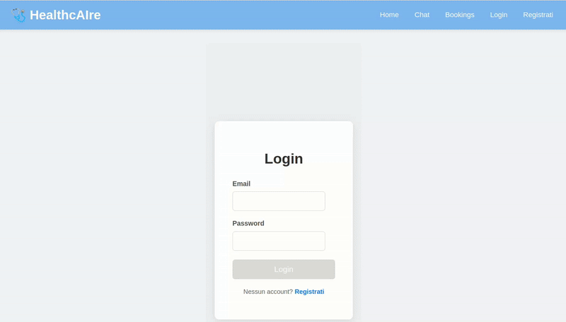
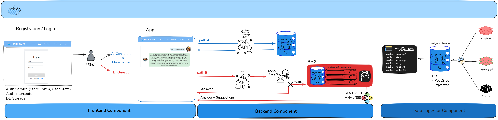

# Healthcare Virtual Assistant  


### Per avviare il progetto

Pre-requisiti: Docker

```
docker compose up --build -d
docker exec -it ollama ollama pull phi3:mini
```



<i>Progetto sviluppato su Ubuntu 22.04 LTS</i>

## Descrizione

Sviluppo di un assistente virtuale per il settore sanitario, in grado di
  - Rispondere a domande complesse dei pazienti
  - Fornire consigli medici di base
  - Gestire gli appuntamenti
  - Comprendere e generare risposte contestuali in modo accurato e naturale

## Componenti

<b>Database</b>
- Relazionale: per informazioni su pazienti, medici, appuntamenti e chat (PostgreSQL)
- Database vettoriale: per la memorizzazione degli embeddings del sistema RAG (pgvector)

<b>Backend</b>
- Sviluppato in FastAPI
- Espone API REST per tutte le operazioni CRUD su pazienti, medici, appuntamenti e chat

<b>Frontend</b>
- Sviluppato in Angular17
- Permette il dialogo con l'assistente, la visualizzazione delle risposte, la gestione degli appuntamenti e la consultazione dello storico chat

## Funzionalità integrate

- Gestione chat: interazione tramite chat con RAG per risposte contestuali (utilizzo dei dataset MedQuAD e MIMIC-III in sinergia)
- Sistema RAG: risposte accurate grazie ai due dataset
- Raccomandazione medico: suggerimento del medico più adatto una volta compresa la necessità del cliente
- Proposta slot liberi: mostrare disponibilità dei medici e prenotazione 
- Visualizzazione prenotazioni: elenco delle proprie prenotazioni
- Storico chat: accesso alle conversazioni passate
- Login/registrazione utente

- <b> Suggerimenti </b> Oltre alla risposta alla domanda sono stati implementati dei suggerimenti in chat (domande collegate alla domanda precedente dell'utente) 

- <b> Intent detection </b>: il sistema è in grado di riconoscere l'intento dell'utente (es. prenotazione, consultazione storico, ecc.) e rispondere di conseguenza

- <b>Sentiment Analysis</b> della domanda per determinare il tono della risposta e il tipo di risposta da generare 

<i>nota: Placeholders TODO: modifica appuntamento / cancellazione appuntamento / modifica password </i>


## Struttura (in dettaglio sui readme di ogni ciascun componente)



- `docker-compose.yml`: file di configurazione per avviare i servizi
- `backend/`: codice sorgente del backend in FastAPI
- `frontend/`: codice sorgente del frontend in Angular
- `data_ingestion/`: script per la creazione del database e l'inizializzazione dei dati

## Visualizzazione
- API endpoints UI : http://localhost:8000/docs#/
- WebApp: http://localhost:8080/
- fare Login con tung@tung.com e password: tung oppure Registrarsi

## Screenshot

<div style="display: flex; justify-content: space-between; gap: 10px;">
  
  
  
</div>
