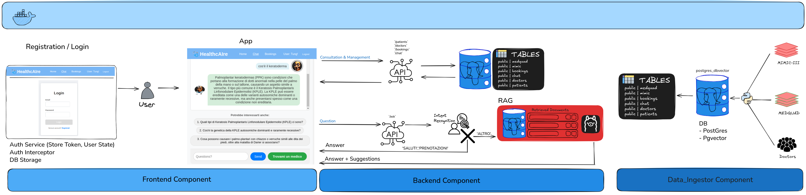
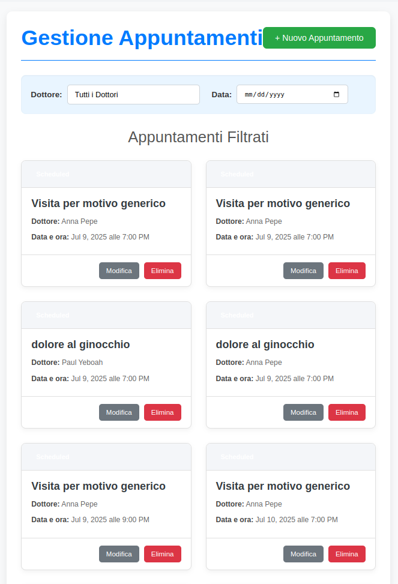
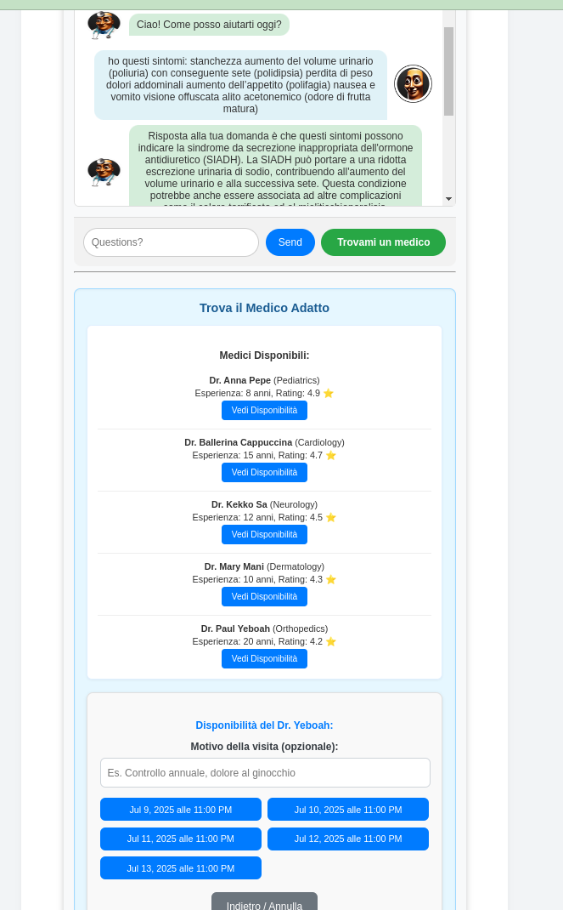

# Healthcare Virtual Assistant 

### Start project
`docker compose up -d`
`docker exec -it ollama ollama pull phi3:mini`

Pre-requisiti: Docker
Progetto sviluppato su Ubuntu 22.04 LTS

## Descrizione

Sviluppo di un assistente virtuale per il settore sanitario. L'obiettivo è creare un sistema che possa:
  - rispondere a domande complesse dei pazienti
  - Fornire consigli medici di base
  - Gestire gli appuntamenti
  - Comprendere e generare risposte contestuali in modo accurato e naturale

Componenti
1. Database
- Relazionale/NoSQL: per informazioni su pazienti, medici, appuntamenti e chat (PostgreSQL)
-Database vettoriale: per la memorizzazione degli embeddings del sistema RAG (DbVector)
2. Backend
- FastAPI
- Espone API REST per tutte le operazioni CRUD su pazienti, medici, appuntamenti e chat
3. Frontend
- Sviluppato in Angular17
- Permette il dialogo con l'assistente, la visualizzazione delle risposte, la gestione degli appuntamenti e la consultazione dello storico chat

Funzionalità principali

- Gestione chat: interazione tramite chat con RAG per risposte contestuali (utilizzo dei dataset MedQuAD e MIMIC-III in sinergia)
- Sistema RAG: risposte accurate grazie ai due dataset
- Raccomandazione medico: suggerimento del medico più adatto una volta compresa la necessità del cliente
- Proposta slot liberi: mostrare disponibilità dei medici e prenotazione 
- Visualizzazione prenotazioni: elenco delle proprie prenotazioni
- Storico chat: accesso alle conversazioni passate
- Login/registrazione utente

## Struttura

- `docker-compose.yml`: file di configurazione per avviare i servizi
- `backend/`: codice sorgente del backend in FastAPI
- `frontend/`: codice sorgente del frontend in Angular
- `data_ingestion/`: script per la creazione del database e l'inizializzazione dei dati

## Come usarlo
- app in: http://localhost:8080/
- api in: http://localhost:8000/docs#/
- fare il login con tung@tung.com e password: tung

## Screenshot

