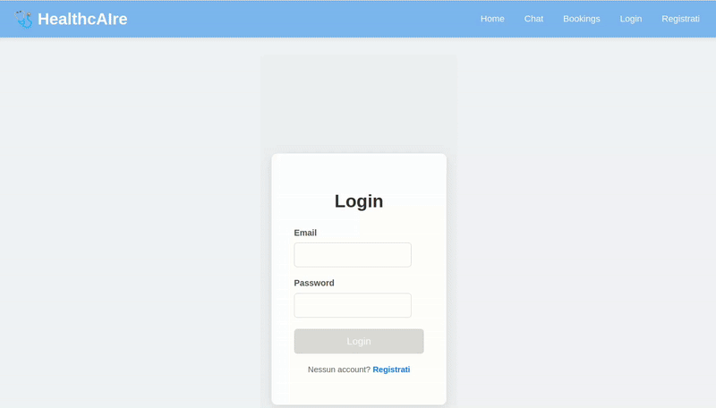
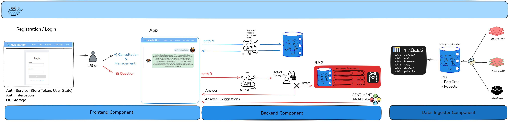
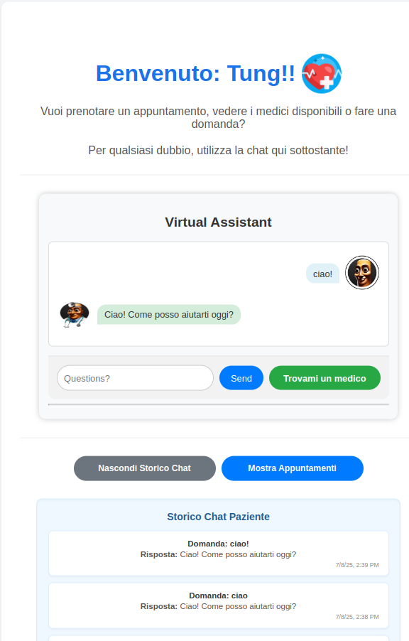
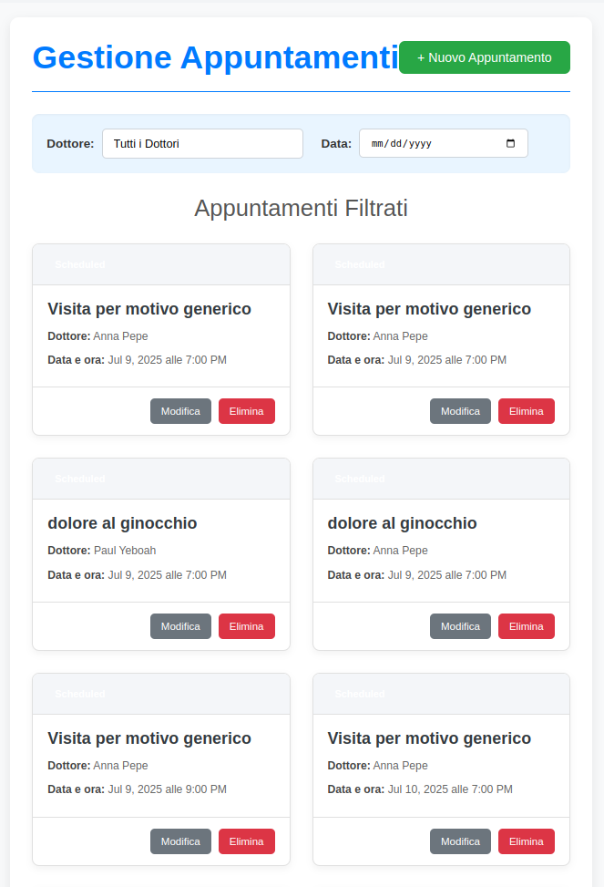
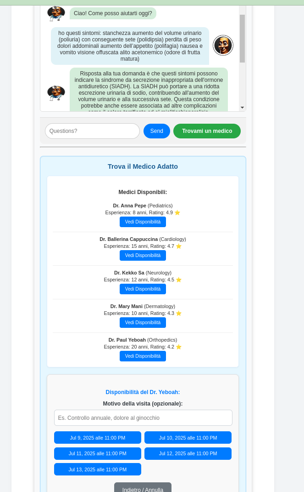

# Healthcare Virtual Assistant  



### Built With


### Getting Started

Prerequisites: Docker

```bash
docker compose up --build -d
docker exec -it ollama ollama pull phi3:mini

```

Project developed on Ubuntu 22.04 LTS

## Description

Development of a virtual assistant for the healthcare sector, capable of:

* Answering complex patient questions
* Providing basic medical advice
* Managing appointments
* Understanding and generating contextual responses accurately and naturally

## Components

Database

* Relational: for information regarding patients, doctors, appointments, and chats (PostgreSQL)
* Vector Database: for storing the RAG system embeddings (pgvector)

Backend

* Developed in FastAPI
* Exposes REST APIs for all CRUD operations on patients, doctors, appointments, and chats

Frontend

* Developed in Angular 17
* Allows dialogue with the assistant, viewing responses, appointment management, and consulting chat history

## Integrated Features

* Chat management: chat interaction with RAG for contextual responses (synergistic use of MedQuAD and MIMIC-III datasets)
* RAG System: accurate responses thanks to the two datasets
* Doctor recommendation: suggesting the most suitable doctor once the client's need is understood
* Free slots proposal: showing doctors' availability and booking
* Bookings visualization: list of your own bookings
* Chat history: access to past conversations
* User login/registration
*  Suggestions : In addition to the answer, chat suggestions have been implemented (questions related to the user's previous question)
*  Intent detection : the system can recognize the user's intent (e.g., booking, checking history, etc.) and respond accordingly
* Sentiment Analysis of the question to determine the tone and type of response to generate

note: Placeholders TODO: modify appointment / cancel appointment / change password 

## Structure (detailed in the readme of each component)


* `docker-compose.yml`: configuration file to start the services
* `backend/`: backend source code in FastAPI
* `frontend/`: frontend source code in Angular
* `data_ingestion/`: scripts for database creation and data initialization

## Visualization

* API endpoints UI: http://localhost:8000/docs#/
* WebApp: http://localhost:8080/
* Login with tung@tung.com and password: tung, or Register

## Screenshot

<div style="display: flex; justify-content: space-between; gap: 10px;">
  
  
  
</div>
