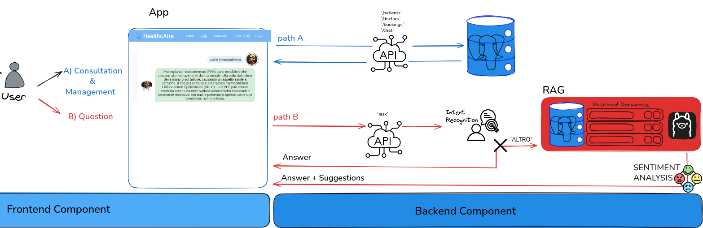

# Backend

Espone API per CRUD operations e per la generazione di risposte contestuali tramite Retrieval Augmented Generation (RAG)

## Consultation & Management (CRUD - Gestione Appuntamenti)
Espone API REST per la consultazione e gestione di:

- Pazienti : `/patients`
- Dottori : `/doctors`
- Appuntamenti :  `/bookings`
- Storico chat : `/chat`

## RAG 

1. Ricezione della query utente `/ask`
2. **`services/db_service.py`**:
   - Genera l'embedding della query
   - Classifica l’intento:
     - Se l’intento è uno tra:
       - `SALUTO_GENERALE`
       - `INFORMAZIONE_ASSISTENTE`
       - `PRENOTAZIONE_MEDICO`  
       👉 genera una risposta immediata, inviata direttamente al frontend.
     - Se l’intento è `ALTRO`:
       - Esegue query di similarità per trovare:
         1. Documenti più simili da **MedQuAD** (Q/A)
         2. Documenti più simili da **MIMIC-III** (context + Q/A)
         3. Messaggi recenti dallo **storico chat** del paziente
       - Unisce e ordina i risultati per similarità, prendendo i top-K documenti (hyperparametro in `config.py`)
       - Passa il contesto aggregato all’LLM

3. **`services/llm_service.py`**:
   - L’LLM riceve un prompt con i documenti da MedQuAD, MIMIC-III e storico chat
   - Genera:
     - Una <b>risposta</b> basata sul contesto
     - <b>Suggerimenti</b> di follow-up (domande simili)
    - Classifica il sentimento della domanda tramite <b>Sentiment Analysis</b> per determinare il tono della risposta e il tipo di risposta da generare 
    - Restituisce la risposta e i suggerimenti al frontend

## Struttura Progetto

- `services/`
  - `db_service.py`: query vettoriali e gestione embedding
  - `llm_service.py`: gestione LLM e riconoscimento intento
- `routers/`
  - `bookings.py`: gestione appuntamenti
  - `chat.py`: gestione storico chat
  - `patients.py`: gestione pazienti
  - `doctors.py`: gestione dottori
- `main.py`: entrypoint FastAPI
- `config.py`: variabili di configurazione e hyperparametri
- `models.py`: definizione modelli Pydantic
- `connection.py`: connessione al database
- `login.py`: gestione registrazione/login
- `auth_utils.py`: autenticazione JWT
