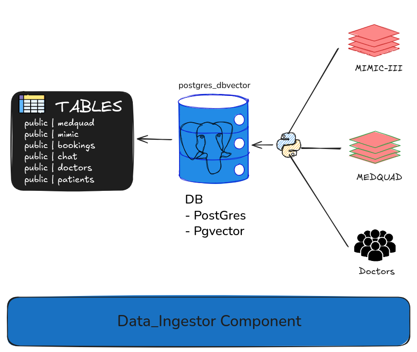

# Data Ingestion

## RAG

### Contesto
Ingestione dei Dataset in database (Postgres+PgVector)

## Data
- MedQuAD: dataset di domande e risposte mediche, utile per rispondere a domande dirette basate su informazioni cliniche.
https://huggingface.co/datasets/lavita/MedQuAD

- MIMIC-III: dataset di note cliniche, utile per fornire contesti più dettagliati e specifici su casi reali.
https://physionet.org/content/mimic-iii-question-answer/1.0.0/

## Struttura Tabelle

### `medquad`

| Campo               | Tipo               | Note                          |
|---------------------|--------------------|-------------------------------|
| id                  | SERIAL PRIMARY KEY | Identificativo unico          |
| question            | TEXT               | Domanda                       |
| answer              | TEXT               | Risposta                      |
| question_embedding  | vector(n)          | Embedding vettoriale della domanda |

---

### `mimic`

| Campo               | Tipo               | Note                          |
|---------------------|--------------------|-------------------------------|
| id                  | SERIAL PRIMARY KEY | Identificativo unico          |
| context             | TEXT               | Contesto clinico              |
| question            | TEXT               | Domanda                       |
| answer              | TEXT               | Risposta                      |
| question_embedding  | vector(n)          | Embedding vettoriale della domanda |

>  `n` corrisponde alla dimensione dell'embedding, es. 768.

---

### `patients`

| Campo         | Tipo              | Note                            |
|---------------|-------------------|---------------------------------|
| id            | SERIAL PRIMARY KEY| Identificativo paziente         |
| name          | VARCHAR(100)      |                             |
| surname       | VARCHAR(100)      |                          |
| sex           | VARCHAR(10)       |                            |
| birth_date    | DATE              |           |
| address       | VARCHAR(255)      |                        |
| phone_number  | VARCHAR(20)       |                            |
| email         | VARCHAR(100)      |                            |
| password_hash | VARCHAR(255)      | Password cifrata                |
| created_at    | TIMESTAMP         | Data di creazione               |

---

### `doctors`

| Campo            | Tipo              | Note                        |
|------------------|-------------------|-----------------------------|
| id               | SERIAL PRIMARY KEY| Identificativo medico       |
| name             | VARCHAR(100)      |                         |
| surname          | VARCHAR(100)      |                      |
| sex              | VARCHAR(10)       |                        |
| birth_date       | DATE              |          |
| address          | VARCHAR(100)      | Indirizzo                   |
| phone_number     | VARCHAR(20)       |                             |
| email            | VARCHAR(100)      |                        |
| specialization   | VARCHAR(100)      | Specializzazione            |
| experience_years | INT               | Anni di esperienza          |
| rating           | FLOAT             | Valutazione (0-5)           |
| created_at       | TIMESTAMP         | Data di creazione           |

---

### `bookings`

| Campo             | Tipo              | Note                                |
|-------------------|-------------------|-------------------------------------|
| id                | SERIAL PRIMARY KEY| Identificativo appuntamento         |
| patient_id        | INT               | FK → `patients(id)`                 |
| doctor_id         | INT               | FK → `doctors(id)`                  |
| appointment_date  | TIMESTAMP         | Data e ora appuntamento             |
| reason_for_visit  | TEXT              | Motivo visita                       |
| status            | VARCHAR(20)       | Stato (es. `scheduled`)             |
| created_at        | TIMESTAMP         | Data di creazione                   |

---

### `chat`

| Campo       | Tipo              | Note                           |
|-------------|-------------------|--------------------------------|
| id          | SERIAL PRIMARY KEY| Identificativo messaggio       |
| patient_id  | INT               | FK → `patients(id)`            |
| doctor_id   | INT               | FK → `doctors(id)`             |
| message     | TEXT              | Messaggio utente               |
| answer      | TEXT              | Risposta generata              |
| timestamp   | TIMESTAMP         | Data e ora del messaggio       |

## Struttura Progetto
- `create_tables.py`: crea le tabelle necessarie nel database (patients, doctors, bookings, chat) e popola quella dei dottori
- `ingest_data_medquad.py`: ingestione del dataset MedQuAD nel database (crea tabella medquad e inserisce i dati)
- `ingest_data_mimic.py`: ingestione del dataset MIMIC-III nel database (crea tabella mimic_notes e inserisce i dati)
- `connection.py`: funzione per connettersi al database  

