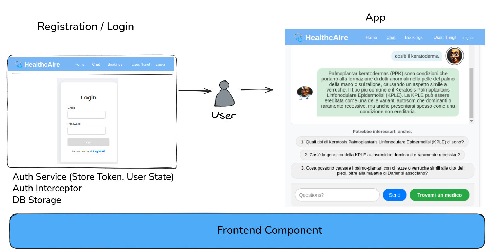
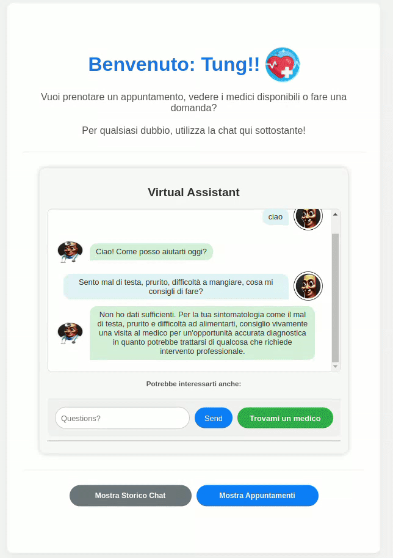

# Frontend

## Web UI

## Struttura dei componenti
- `src/`: codice sorgente dell'applicazione Angular
- `src/assets/`: risorse statiche (immagini e icone)
- `src/app/`: componenti, servizi e moduli dell'applicazione
    - `app/`: componenti riutilizzabili
        - `app.component.*/`: contiene la barra di navigazione e il footer
        - `home/`: richiama il componente chat e bookings, contiene lo storico chat
        - `chat/`: gestisce la chat con l'assistente virtuale
        - `bookings/`: gestisce la visualizzazione e prenotazione degli appuntamenti
        - `login/`: gestisce il login e la registrazione degli utenti
        - `register/`: gestisce la registrazione degli utenti
        - `services/`: servizi per comunicare con il backend
        - `models/`: modelli TypeScript per le entità dell'applicazione
        - `interceptors/`: gestisce gli interceptor per le richieste HTTP
        - `guards/`: gestisce le guardie per la protezione delle rotte
- `angular.json`: configurazione del progetto Angular

<i>nota: escludo la spiegazione degli altri file in quanto non rilevanti per la comprensione del progetto </i>

## Funzioni Chat, Gestione Appuntamenti e Visualizzazione Storico

